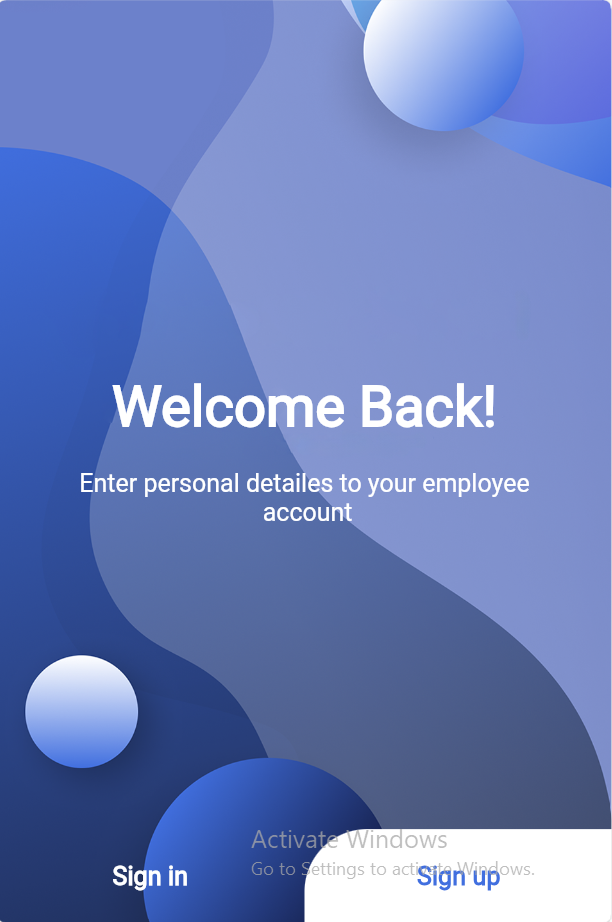
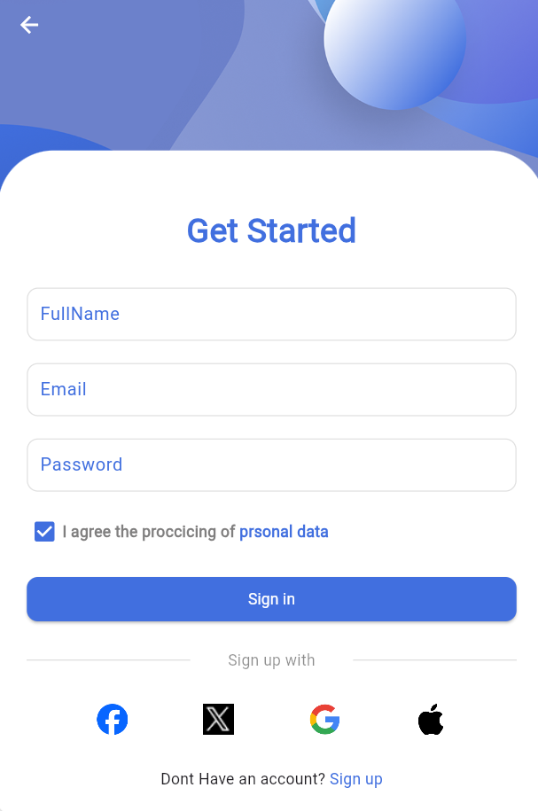
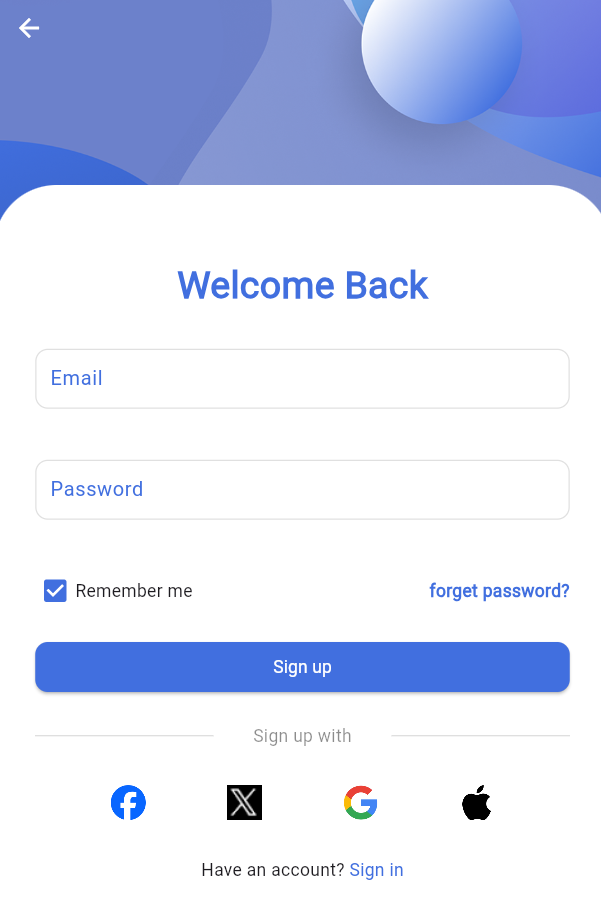

# Flutter UI Project – Auth Screens by Aya Ibrahim Alastal

This Flutter project showcases 3 clean and responsive UI screens designed for a mobile authentication flow. Developed as part of Aya Ibrahim Alastal’s practice in Flutter.

---

## 📱 Screens:

1. **Home Screen**  
   - Simple landing page  
   - Two buttons:  
     - Navigate to Sign In  
     - Navigate to Sign Up

2. **Sign In Screen**  
   - Email and password input fields  
   - Sign In button  
   - Clean layout using TextFields and Column

3. **Sign Up Screen**  
   - Name, email, and password fields  
   - Sign Up button  
   - Consistent design with Sign In page

---

## 🧰 Technologies Used:

- Flutter & Dart
- Material Design Widgets
- Stateless & Stateful Widgets
- Page Navigation using `Navigator.push`
- 
## 👩‍💻 Developed By:
**Aya Ibrahim Alastal**  
Flutter Developer – Focused on UI/UX layout and navigation

## 📸 Screenshots:

 🏠 Home Screen

🔐 Sign In Screen

📝 Sign Up Screen

